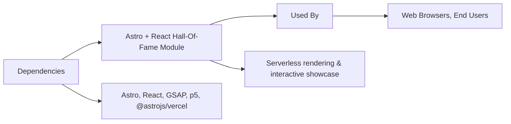

# Astro + React Hall-Of-Fame Showcase Module

## Overview
The Hall-Of-Fame Showcase Module is a web module built with Astro and React that enables fast, flexible interactive showcases. It leverages modern frontend frameworks for rich animations and presentation features. Designed to be deployed serverlessly (e.g., via Vercel), it simplifies the creation and sharing of gallery or button-based hall-of-fame experiences.

## Key Features
- **Astro and React Integration**: Combines Astro's performance and server-side rendering with React's interactivity, allowing developers to craft dynamic user interfaces.
- **Serverless Deployment (Vercel Adapter)**: Easily deploy your showcase with optimized serverless architecture, reducing maintenance and scaling effort.
- **External Animation & Visualization Libraries**: Supports GSAP for advanced animations and p5.js for creative coding and visualization within showcases.
- **Cross-Framework Component Support**: Seamlessly use React components in Astro pages, making it suitable for teams with mixed technology stacks.

## System Errors
- **Build Errors (Astro/React)**: Occur if incompatible or missing dependencies.  
  **Resolution**: Ensure all required dependencies in `package.json` are installed. Run `npm install`.
- **Deployment Misconfiguration (Vercel Adapter)**: Deployment fails if the adapter is not properly configured.  
  **Resolution**: Confirm `@astrojs/vercel` is added in `astro.config.mjs` and that output is set to `server`.
- **Component Import Errors**: Errors when importing React components into Astro pages due to syntax or module misalignments.  
  **Resolution**: Follow Astro’s [integration guide for React](https://docs.astro.build/en/guides/integrations-guide/react/) and use the `.jsx` or `.tsx` extensions as needed.

## Usage Examples

```jsx
// src/pages/index.astro
---
import ButtonShowcase from '../components/ButtonShowcase.jsx';
---
<html>
  <head><title>Hall-Of-Fame Showcase</title></head>
  <body>
    <h1>Button Hall of Fame</h1>
    <ButtonShowcase />
  </body>
</html>
```

```jsx
// src/components/ButtonShowcase.jsx
import React from "react";
import gsap from "gsap";
export default function ButtonShowcase() {
  // GSAP or p5 based effect can be added here
  return (
    <div>
      <h2>Featured Buttons</h2>
      <button onClick={() => gsap.to("button", { scale: 1.2 })}>
        Animate Me
      </button>
    </div>
  );
}
```

## System Integration


