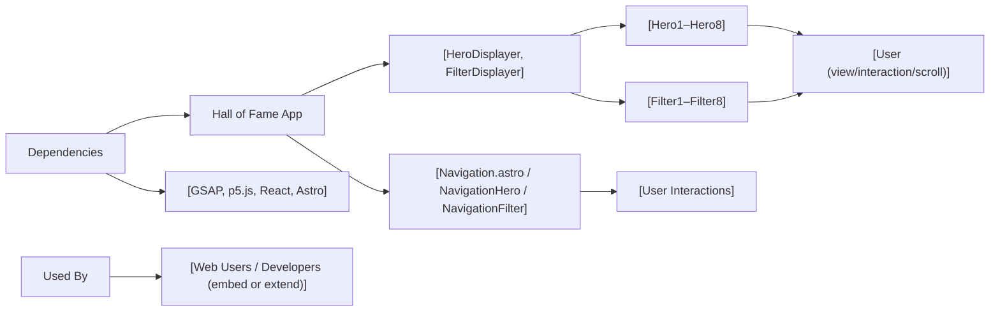

# Hall of Fame – API & Feature Overview

## Overview

The Hall of Fame application is an interactive, multimedia-rich web platform highlighting creative visual content through two main modules: **HeroDisplayer** and **FilterDisplayer**. The system enables users to browse impressive animated "Hero" sections and experiment with interactive camera-based visual filters. Designed for engagement and inspiration, the application combines advanced UI/UX animations (with GSAP) and real-time video processing (with p5.js) in a navigable environment.

## Key Features

- **Hero Section Display (`HeroDisplayer`):**  
  Lets users navigate through a set of visually immersive and animated hero sections. Each hero module employs unique effects and layouts—such as scroll-based 3D carousels, interactive image masks, and drag-based galleries—adapting responsively to desktop or mobile form factors.

- **Camera Filter Playground (`FilterDisplayer`):**  
  Provides a collection of creative, real-time camera filters (8 total), allowing users to manipulate their webcam feed with artistic visual transformations (pixel art, ASCII, grayscale, multi-color, etc.).

- **Navigation Components (`Navigation.astro`, `NavigationHero`, `NavigationFilter`):**  
  Supplies intuitive site-wide navigation and context-specific controls for feature switching and progression, including audio controls in the Hero sections and explicit camera permission cues in Filter modules.

- **Responsive Design:**  
  Dynamically tailors the experience to device screen sizes, adjusting available hero content and module layouts for mobile and desktop.

- **Dynamic Loading & Performance:**  
  Both Hero and Filter components are loaded lazily, reducing initial load times and optimizing resource usage per active view.

- **Custom User Interactions:**  
  Hero sections support advanced interactions (mouse-drag to reveal, cursor tracking, scroll animations, hover-aware image scaling, etc.), while Filter sections enable real-time video effects manipulation.

## System Errors

- **Camera Access Denied:**  
  - *Description:* User does not grant the browser access to their webcam, required for FilterDisplayer.  
  - *Resolution:* Prompt the user to allow camera access in the browser prompt; follow on-screen instructions.

- **WebGL or Browser Not Supported:**  
  - *Description:* Real-time filters or GSAP animations may fail if the browser lacks WebGL or modern JavaScript support.  
  - *Resolution:* Advise the user to update their browser to the latest version and ensure hardware acceleration is enabled.

- **Missing Media Assets:**  
  - *Description:* Hero sections rely on local images; missing/corrupt images will impact visual presentation.  
  - *Resolution:* Confirm all referenced images exist in `/images` folders with correct naming and formats.

- **Audio Playback Blocked:**  
  - *Description:* Some browsers block auto-playing audio in NavigationHero.  
  - *Resolution:* Prompt user action to toggle sound explicitly.

- **Module Not Rendering on Mobile/Small Screens:**  
  - *Description:* Certain Hero modules are conditionally rendered based on screen size.  
  - *Resolution:* Switch to a desktop device for the full set of experiences.

## Usage Examples

```jsx
// Displaying the Hero Section with navigation and audio controls
import HeroDisplayer from './src/HeroDisplayer';

function App() {
  return <HeroDisplayer />;
}

// Displaying the Camera Filter Playground (ensure camera permissions in browser)
import FilterDisplayer from './src/FilterDisplayer';

function App() {
  return <FilterDisplayer />;
}

// Navigating between features (in Astro or React environments)
import Navigation from './src/components/Navigation.astro';

// Inside Astro page/layout
---
// Astro logic
---
<Navigation />

// Using Hero or Filter navigation bar inside their respective modules
import NavigationHero from './src/components/NavigationHero'; // With next/prev and sound control
import NavigationFilter from './src/components/NavigationFilter'; // For choosing filters

<NavigationHero onNextClick={...} onPreviousClick={...} />
<NavigationFilter setCurrentFilterIndex={...} />
```

## System Integration



---

**Note:**  
- To embed Hall of Fame into another app, use and compose the main modules (`HeroDisplayer`, `FilterDisplayer`).
- To extend, add new Hero or Filter submodules following the established conventions; register them in their respective module arrays for dynamic inclusion.
- The platform assumes a modern JavaScript browser context with camera and media access when using filters.  
- All UI/UX, interaction, and feature flows are surfaced via public APIs and high-level props—no internal implementation dependencies required for consumers.