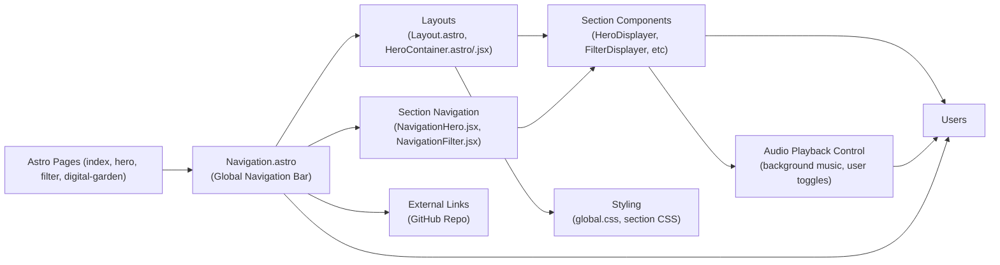

# Hall of Fame: Navigation and Layout Architecture

## Overview
This module governs the navigation and layout infrastructure for the Hall of Fame web application. It centralizes navigation links, page layout, hero and filter sections, and page-specific container management, enabling users to move seamlessly through the application’s sections such as the hero gallery, filter page, and digital garden. It ensures consistent structural presentation and user experience across all pages.

## Key Features

- **Global Navigation Bar**: Interactive top navigation (`Navigation.astro`) provides quick access to main app sections (Home, Hero Section, Filter, Digital Garden, external GitHub Repo).
- **Page-Wide Layout Containers**: Consistent structure for content via `Layout.astro` and `HeroContainer.astro`/`.jsx`, ensuring unified metadata, responsive design, and CSS application.
- **Section-Specific Navigation**: 
  - **Hero Section Navigation (`NavigationHero.jsx`)**: Offers hero browsing controls (previous/next), home navigation, and integrated audio playback controls.
  - **Filter Section Navigation (`NavigationFilter.jsx`)**: Displays and updates photo/video filter selections, prompting users to allow camera access for interactive filters.
- **Audio Playback Control**: Exposes controls for toggling background music on key pages (Home and Hero), improving user engagement.
- **Route Integration**: All major pages (`index.astro`, `hero.astro`, `filter.astro`, `digital-garden.astro`) utilize these navigation and layout components for a cohesive look and feel.
- **Styling Consistency**: Applies global and section-specific CSS for layout and interaction uniformity.

## System Errors

- **Audio Playback Not Starting**
  - **Description**: Audio may not play due to browser auto-play restrictions or if user interaction is required.
  - **Resolution**: Ensure the user clicks the "ACTIVATE SOUND" or "Sound Off/Sound On" control after the page loads. Engage or allow necessary browser permissions for audio playback.
- **Camera Access Denied in Filter Section**
  - **Description**: Interactive filters requiring camera input will not function if camera access isn’t granted.
  - **Resolution**: Instruct users (via UI prompt) to allow camera access. Troubleshoot by reloading the page and ensuring browser permissions enable camera use.
- **Navigation Link Doesn't Work**
  - **Description**: If clicking a navigation link fails to switch pages, the route may be incorrectly configured or resources may be missing.
  - **Resolution**: Confirm all linked routes are correctly defined and components are imported on destination pages. Check browser console for routing or missing component errors.

## Usage Examples

```jsx
// Example: Including the global Navigation bar and Layout in a page (Astro syntax)
---
import Layout from '../layouts/Layout.astro';
import Navigation from '../components/Navigation.astro';
import '../styles/global.css';
---
<Navigation/>
<Layout title="Hall of Fame">
  <div>/* Page Content Goes Here */</div>
</Layout>

// Example: Using Hero Section Navigation (React, used inside a component)
import NavigationHero from '../components/NavigationHero.jsx';

<NavigationHero 
  onPreviousClick={handlePrevHero} 
  onNextClick={handleNextHero} 
/>

// Example: Using Filter Navigation for Camera Filters (React)
import NavigationFilter from '../components/NavigationFilter.jsx';

<NavigationFilter setCurrentFilterIndex={setFilterIndex} />
```

## System Integration

