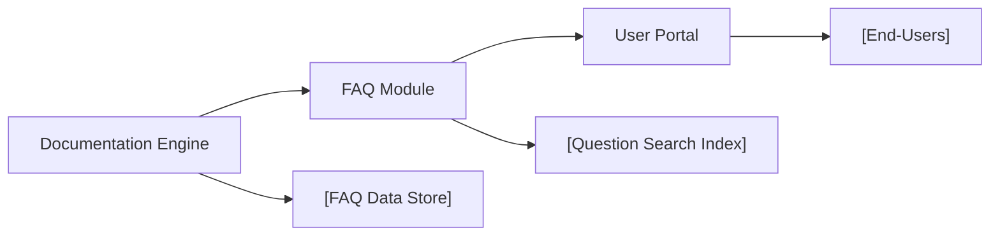

# FAQ Module

## Overview
The FAQ module provides a centralized location for frequently asked questions and their answers within the Hall-Of-Fame system. Its purpose is to enhance user experience by offering quick guidance, reducing common support requests, and clarifying how to interact with key system features.

## Key Features
- **Question Search**: Allows users to quickly find answers by searching for relevant questions.
- **Categorized FAQs**: Organizes FAQs into categories to help users navigate topics of interest efficiently.
- **Inline Linking**: Links questions and answers to related documentation or system components for deeper information.
- **Easy Updates**: Admins can add, remove, or update FAQs without system downtime.

## System Errors
- **FAQ Not Found**: Occurs when a searched FAQ entry doesn't exist.
  - **Resolution**: Verify the search term or browse available categories. Admins can add missing FAQs if necessary.
- **Access Denied**: Users lack permission to edit or add FAQ entries.
  - **Resolution**: Ensure user has appropriate admin or editor privileges.
- **Content Formatting Error**: Display issues if FAQ content is not properly formatted.
  - **Resolution**: Check FAQ entry for formatting consistency and update as needed.

## Usage Examples

```markdown
## How do I nominate someone for the Hall of Fame?
To nominate, click on the "Nominate" button in the navigation bar and fill in the nominee's details.

## Where can I find the list of previous inductees?
Visit the "Inductees" section from the main menu to view past Hall of Fame members.

## Can I edit my nomination after submitting?
No, nominations are final, but you can contact support for corrections.
```

## System Integration


