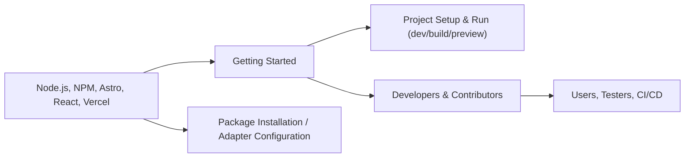

# Getting Started

## Overview
The Getting Started module provides new users and developers with the essential steps and guidance needed to launch and run the Hall-Of-Fame project. Its purpose is to outline the required tools, dependencies, and commands to quickly initialize the project in a local development environment or deploy it using supported platforms.

## Key Features
- **Quick Setup Instructions**: Clear, step-by-step setup guide for installing dependencies and running the project locally.
- **Platform Integration Guidance**: Directions on how to deploy the project using the built-in Vercel serverless adapter.
- **Technology Stack Summary**: Overview of core technologies, such as Astro and React, used within the project.
- **Development and Preview Commands**: Usage of scripts for development (`dev`), building (`build`), and previewing (`preview`) the site.

## System Errors
It's important to document common errors and troubleshooting specify :
- **Missing Dependencies**: Project fails to start if required Node.js modules are not installed.  
  **Resolution**: Run `npm install` before starting or building the project.
- **Port Conflicts**: The development server may not start if the default port is in use.  
  **Resolution**: Stop other processes using the port or define a different port when starting.
- **Vercel Deployment Issues**: Errors deploying to Vercel often arise from incorrect adapter configuration.  
  **Resolution**: Ensure the `@astrojs/vercel` package is installed and configured in `astro.config.mjs`.

## Usage Examples
Practical code examples showing how to use the module:

```bash
# 1. Install dependencies
npm install

# 2. Start development server
npm run dev

# 3. Build the site for production
npm run build

# 4. Preview the built site locally
npm run preview

# 5. Deploy to Vercel (after connecting your repo to Vercel)
# Vercel will auto-detect the Astro project and use the configured serverless adapter.
```

## System Integration
Complete the Mermaid diagram showing how this module integrates with the system:

